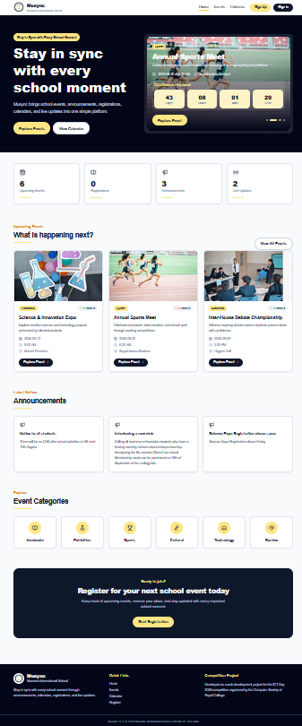
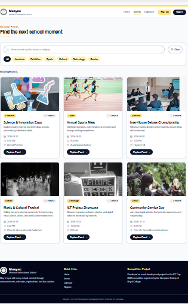
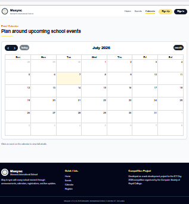
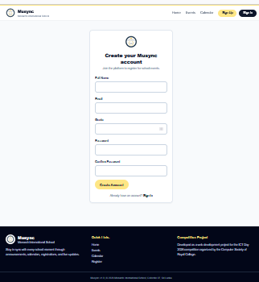
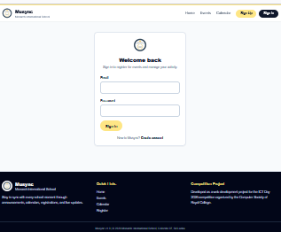
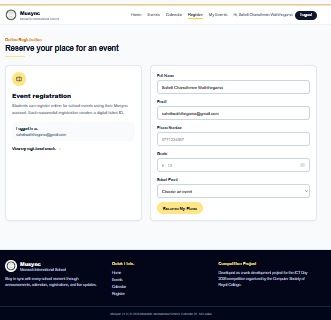
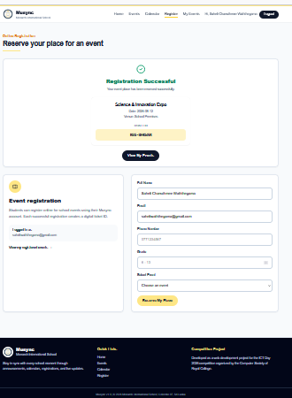
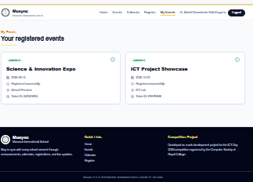
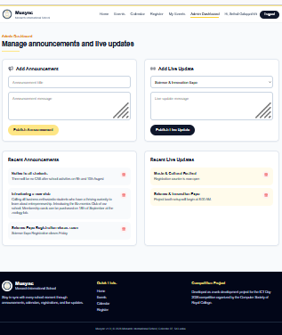
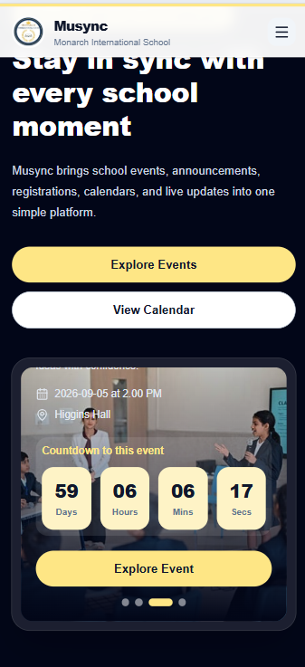

# Musync – School Event Management Platform


## Web Development Competition 2026

**Student:** Saheli Chanuthmee Waththegama

**Grade:** 9

**School:** Musaeus College, Colombo 07, Sri Lanka

## 🌐 Live Demo

[Live Demo] (https://musync-phi.vercel.app/)

## 💻 GitHub Repository

[GitHub Repository] (https://github.com/saheliwaththegama/musync) 

---

## About My Project

Musync is a school event management website that I developed for the **Web Development Competition organized by the Computer Society of Royal College for their annual ICT Day 2026**.

The main goal of this project is to make it easier for students and parents to find school events, register online, receive announcements, and stay updated with school activities in one place.

While developing this project, I learned how to build a complete web application using modern web technologies and cloud services.

---
## Why I Chose This Project

At school, many event details are shared in different ways, and we can sometimes miss important information. I wanted to create a simple website where students can easily find events, register online, and receive updates in one place. 

## Main Features

### Students Features

- Create an account and sign in
- View upcoming school events
- Search and filter events
- View event details
- Register for events online
- View registered events
- Receive announcements
- View live event updates

### Administrators Features

- Publish announcements
- Delete announcements
- Publish live event updates
- Delete live event updates

## General Features

- Responsive Design
- Interactive Calendar
- Modern User Interface
- Firebase Authentication
- Cloud Firestore Database
---

## Technologies Used

- React
- Vite
- Tailwind CSS
- Firebase Authentication
- Cloud Firestore
- React Router
- FullCalendar
- Lucide React Icons
- Git & GitHub
- Vercel

---

## Project Folder

```
Musync
│
├── public
├── src
│   ├── assets
│   ├── components
│   ├── config
│   ├── contexts
│   ├── data
│   ├── firebase
│   ├── hooks
│   ├── pages
│   └── utils
│
├── .env.example
├── package.json
├── vite.config.js
└── README.md

---

## How to Run the Project

Clone the repository.

```bash
git clone https://github.com/saheliwaththegama/musync.git
```

Install the required packages.

```bash
npm install
```

Create a `.env` file using the `.env.example` file and add your own Firebase configuration.

Start the project.

```bash
npm run dev
```

To create the production version.

```bash
npm run build
```

---

## Screenshots

### Home Page


### Events Page


### Calendar


### Sign Up


### Sign In


### Registration


### Registration Successful


### My Events


### Admin Dashboard


### Mobile View


---

## What I Learned

This project helped me improve my knowledge of:-

- React
- Firebase
- Cloud databases
- Responsive web design
- Git and GitHub
- Problem solving
- Software development
This project also gave me confidence in developing and deploying a complete web application.
---

## Future Improvements

If I continue developing this project, I would like to add:-

- QR code event tickets
- Email notifications
- Event attendance using QR scanning
- More event categories
- Event Photo Gallery
- Admin Event Management
- School Club Management


---

## Demo Accounts for Evaluation

The following demo accounts are provided to help the judges evaluate all features of the application.

### Student Account

Email: student@musync.com  
Password: MuStudent1#

### Admin Account

Email: admin@musync.com  
Password: MuAdmin1#

---

## Thank You

Thank you for taking the time to review my project.

I hope you enjoy using **Musync**.

---

**Developed by**

**Saheli Chanuthmee Waththegama**

Grade 9

Musaeus College, Colombo 07, Sri Lanka

For the **Web Development Competition organized by the Computer Society of Royal College for their annual ICT Day 2026**.